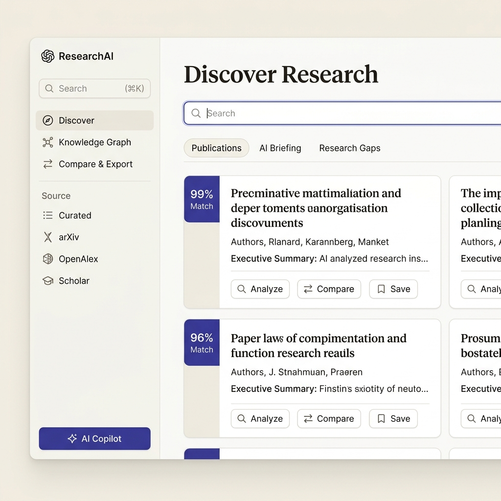
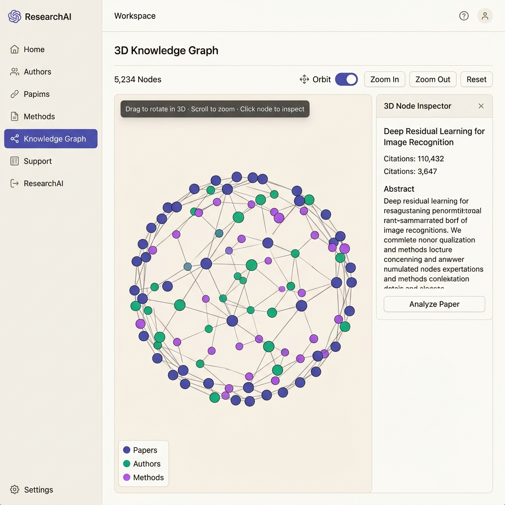

# ResearchAI — Smart Paper & Research Intelligence Studio

🚀 **Live App URL**: [https://research-ai-swart.vercel.app/](https://research-ai-swart.vercel.app/)

[](https://www.typescriptlang.org/)
[](https://react.dev/)
[](https://threejs.org/)
[](https://vitejs.dev/)
[](https://tailwindcss.com/)
[](https://research-ai-swart.vercel.app/)

**ResearchAI** is a premium, AI-powered academic research platform designed to streamline every phase of scientific discovery: literature search, methodology analysis, gap detection, 3D relationship visualization, paper comparison, literature review generation, and AI copilot interaction.

---

## 🌐 Live Web Application

Access the fully deployed application live at: **[https://research-ai-swart.vercel.app/](https://research-ai-swart.vercel.app/)**

---

## 📸 Current Version Screenshots & Previews

### 1. Academic Research Workspace


### 2. Interactive 3D WebGL Knowledge Graph


---

## 🌟 Key Features & Highlights

- **🔍 Multi-Engine Paper Search**:
  - Live search across **Semantic Scholar API**, **arXiv API**, **OpenAlex API**, and **Google Scholar** (via SerpAPI).
  - Accurately ranks papers by relevance, citation count, and match score (0–99%).

- **🤖 AI Briefing & Research Gap Detector**:
  - **AI Briefing**: Synthesizes key concepts, research directions, and emerging trends.
  - **Unexplored Gap Detector**: Automatically identifies maturity levels, supporting paper counts, and research opportunities.

- **🌐 Interactive 3D Knowledge Graph (Three.js WebGL)**:
  - Nodes (Papers, Authors, Methods) float in a 3D spherical orbital space (`x, y, z`) using Fibonacci 3D distribution algorithms.
  - Interactive 3D rotation, camera zooming, auto-orbiting, and 3D raycast clicking.

- **⚖️ Paper Comparator & Exporter**:
  - Side-by-side comparison of problems, methodologies, benchmark results, and limitations.
  - One-click literature review generation in **`.MD`** (Markdown) and **`.BIB`** (BibTeX citations).

- **🔬 Deep Paper Analyzer Modal**:
  - Detailed breakdown of abstracts, LaTeX formulas, code repositories, and future directions.

- **💬 AI Research Copilot**:
  - Interactive AI chat assistant grounded in your search results to answer questions about any publication.

---

## 📁 Repository Structure

```
Research AI/
├── index.html                   # HTML entry point (DM Serif Display & Inter fonts)
├── tailwind.config.js           # Warm neutral workspace color tokens
├── public/
│   └── screenshots/             # Current application screenshots for GitHub README
│       ├── current_workspace.png
│       └── 3d_graph.png
├── src/
│   ├── App.tsx                  # Primary workspace layout & multi-source search state
│   ├── index.css                # Base styling & custom scrollbars
│   ├── types/
│   │   └── research.ts          # TypeScript interfaces (Paper, Analysis, Topic, 3D Node)
│   ├── mockData/
│   │   └── curatedPapers.ts     # Initial curated paper dataset
│   ├── services/
│   │   ├── semanticScholarService.ts # Semantic Scholar Graph API
│   │   ├── arxivService.ts           # arXiv REST API with title/abstract targeting
│   │   ├── openAlexService.ts        # OpenAlex relevance search
│   │   ├── googleScholarService.ts   # SerpAPI Google Scholar engine
│   │   └── aiSynthesisService.ts     # AI overview, gaps, comparison verdict & chat
│   └── components/
│       ├── layout/
│       │   └── Navbar.tsx            # Sidebar navigation layout & SerpAPI Key config
│       ├── discovery/
│       │   ├── ResearchSearchArea.tsx# Search bar & suggestion chips
│       │   ├── RecommendationHub.tsx # Filter toolbar & publication list
│       │   ├── PaperCard.tsx         # Publication card with list/grid modes
│       │   ├── AIResearchOverview.tsx# AI briefing card
│       │   └── ResearchGapDetector.tsx # Research gap card grid
│       ├── analysis/
│       │   ├── DeepPaperAnalyzer.tsx # Detailed paper analyzer modal
│       │   ├── PaperComparator.tsx   # Side-by-side paper comparison table
│       │   └── LiteratureReviewExporter.tsx # Markdown & BibTeX exporter
│       ├── graph/
│       │   └── KnowledgeGraphCanvas.tsx # Three.js 3D WebGL Knowledge Graph
│       ├── copilot/
│       │   └── AIChatCopilot.tsx     # AI Chat Copilot drawer
│       └── archive/                  # Preserved prototype components
│           ├── TopicExplorer.tsx
│           └── WorkflowTracker.tsx
```

---

## 🛠️ Quick Start

### 1. Live Online Access
Simply visit **[https://research-ai-swart.vercel.app/](https://research-ai-swart.vercel.app/)** to use the application immediately.

### 2. Local Setup
```bash
git clone https://github.com/MeshramYug/Research_AI.git
cd Research_AI
npm install
npm run dev
```
Open [http://localhost:5173/](http://localhost:5173/) in your browser.

---

## 📜 License

MIT License. Designed for AI academic research and scientific intelligence exploration.
